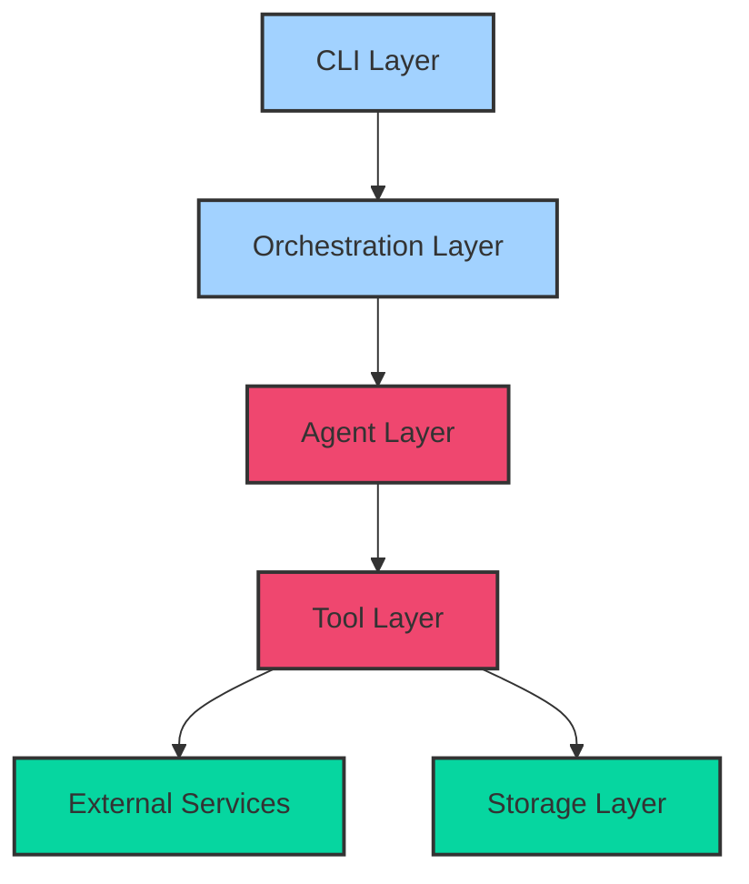
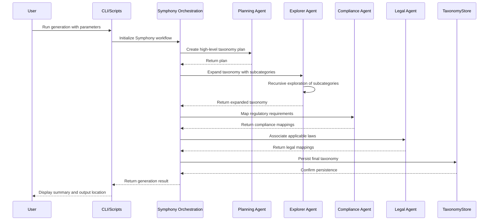
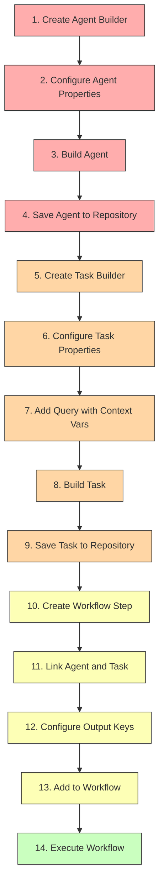
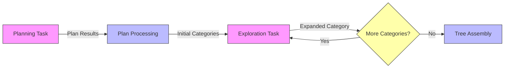
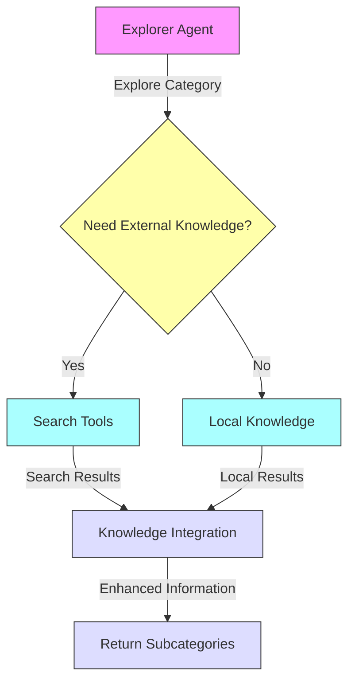
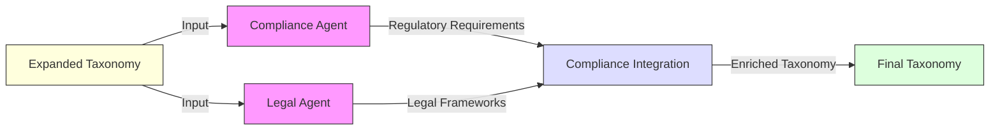
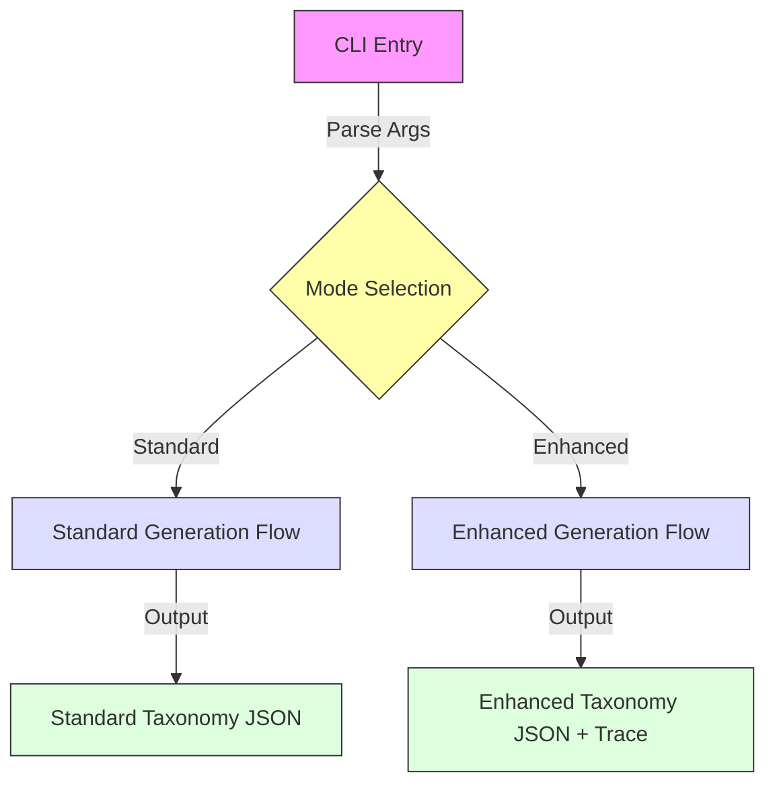
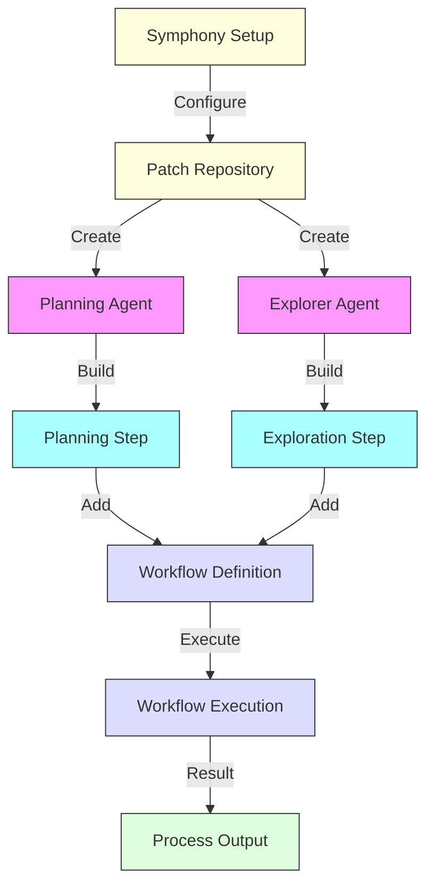

# Taxonomy Planner Architecture and Flow

## Overview

The Taxonomy Planner is an advanced multi-agent system designed to generate comprehensive taxonomies for regulatory compliance across various domains and jurisdictions. It leverages Symphony's agent orchestration capabilities to create structured taxonomies with rich metadata that can be used for compliance classification, knowledge organization, and regulatory mapping.

## Core Concepts

### Taxonomy Structure

A taxonomy in our system consists of:

1. **Categories** - Hierarchically organized nodes that form a tree structure
2. **Metadata** - Associated information for each category, including:
   - **Basic metadata**: Description, parent-child relationships
   - **Enhanced metadata**: Enforcement examples, social media trends, risk level, detection methods

### Agent Types

The taxonomy planner utilizes four specialized agent types:

1. **Planning Agent** - Creates the initial taxonomy structure and high-level plan
2. **Explorer Agent** - Expands categories with subcategories and detailed information
3. **Compliance Agent** - Maps regulatory requirements to appropriate categories
4. **Legal Agent** - Associates applicable laws and legal frameworks to categories

## System Architecture

The Taxonomy Planner follows a layered architecture:



### Layer Responsibilities

1. **CLI Layer** (`generate_taxonomy.py`, `generate_multiple.sh`)
   - Command-line interface for taxonomy generation
   - Parameter parsing and validation
   - Execution flow control

2. **Orchestration Layer** (`main.py`)
   - Workflow definition and execution
   - Agent creation and coordination
   - Context management between steps

3. **Agent Layer** (`agents.py`)
   - Specialized domain agents 
   - Pattern-enhanced reasoning
   - Task execution

4. **Tool Layer** (`tools/`)
   - Knowledge base access
   - Search capabilities
   - Regulatory and legal mapping

5. **Storage Layer** (`persistence.py`)
   - Taxonomy persistence
   - Tree structure maintenance
   - Serialization/deserialization

## Core Workflow

The taxonomy generation follows this core workflow:



## Agent Execution Pattern

The Taxonomy Planner implements Symphony's correct agent execution pattern:



This pattern ensures:
- Proper agent persistence
- Context sharing between workflow steps
- Separation of agent capabilities from execution logic
- Reusability of agents across workflows

## Key Agent Interaction Patterns

### Planning-Exploration Pattern

The Planning-Exploration pattern forms the core of taxonomy generation:



### Search-Enhanced Exploration

For domains requiring external knowledge:



### Multi-Agent Compliance Mapping

For comprehensive regulatory coverage:



## Implementation Details

### Standard vs. Enhanced Mode

The system supports two primary modes of operation:

1. **Standard Mode**:
   - Basic taxonomy generation with category hierarchy
   - Traditional execution flow
   - Compatible with older workflows

2. **Enhanced Mode**:
   - Additional taxonomy fields (description, enforcement_examples, etc.)
   - Symphony workflow-based execution
   - Custom JSON serialization with datetime support

### Command-Line Interface



The CLI supports configuration of:
- Category domain
- Jurisdictions
- Exploration depth and breadth
- Model selection for each agent
- Enhanced fields selection
- Output and storage directories

### Taxonomy Store

The `TaxonomyStore` class provides:
- Tree-based organization of taxonomy categories
- Flexible metadata storage
- JSON serialization
- Hierarchical relationship management

### Symphony Integration

The enhanced mode leverages Symphony's workflow capabilities:



## Extension Points

The Taxonomy Planner is designed for extensibility at multiple levels:

### 1. Adding New Enhanced Fields

To add new fields to the taxonomy structure:

```python
# 1. Update the ENHANCED_FIELDS constant in generate_taxonomy.py
ENHANCED_FIELDS = [
    "description",
    "enforcement_examples",
    "social_media_trends",
    "risk_level",
    "detection_methods",
    "your_new_field"  # Add your field here
]

# 2. Update agent instructions to include the new field
```

### 2. Adding New Agent Types

To create a specialized agent:

```python
# 1. Define the agent in the workflow building process

# Create specialized agent
specialized_agent_builder = symphony.build_agent()
specialized_agent_builder.create(
    name="SpecializedAgent",
    role="Specialized domain knowledge expert",
    instruction_template=(
        f"Analyze the taxonomy for {category} with focus on X. "
        f"Provide specialized insights including: "
        f"{', '.join(enhanced_fields)}. "
    )
)
specialized_agent = specialized_agent_builder.build()
specialized_agent_id = await symphony.agents.save_agent(specialized_agent)

# 2. Create a task for the agent
specialized_task_builder = symphony.build_task()
specialized_task = specialized_task_builder.create(
    name="SpecializedTask",
    description=f"Specialized analysis for {category}"
).with_query(
    "Analyze the taxonomy with specialized knowledge: {{taxonomy_plan}}"
).build()
specialized_task_id = await symphony.tasks.save_task(specialized_task)

# 3. Add a workflow step
specialized_step = (workflow_builder.build_step()
    .name("SpecializedAnalysis")
    .description("Perform specialized analysis")
    .agent(specialized_agent)
    .task({"id": specialized_task_id})
    .output_key("specialized_output")
    .build()
)
workflow_builder.add_step(specialized_step)
```

### 3. Customizing Search Capabilities

To enhance search functionality:

```python
# 1. Extend the search tools with new methods
def search_custom_domain(category: str, config: TaxonomyConfig = None) -> Dict[str, Any]:
    """Custom domain-specific search."""
    # Implementation details...
    return results

# 2. Update the exploration pattern to use the new search method
```

### 4. Implementing New Patterns

To add a new interaction pattern:

```python
# 1. Define a new pattern class
class CustomPattern(BasePattern):
    """Custom interaction pattern."""
    
    def __init__(self, config: Dict[str, Any] = None):
        super().__init__(config or {})
        
    async def apply(self, context: Dict[str, Any]) -> Dict[str, Any]:
        # Implementation details...
        return enhanced_context

# 2. Register and use the pattern in the workflow
```

## Usage Examples

### Basic Usage

To generate a standard taxonomy:

```bash
python generate_taxonomy.py "Alcohol" --jurisdictions "USA,EU" --output-dir "output/alcohol"
```

### Enhanced Taxonomy Generation

To generate a taxonomy with enhanced fields:

```bash
python generate_taxonomy.py "Weapons" --enhanced --jurisdictions "USA" --output-dir "output/weapons"
```

### Batch Generation

To generate multiple taxonomies:

```bash
./generate_multiple.sh --categories "Alcohol,Weapons,Nudity" --enhanced --output-dir "output/regulatory"
```

### Customizing Enhanced Fields

To customize which enhanced fields to include:

```bash
python generate_taxonomy.py "Financial Services" --enhanced --fields "description,risk_level,regulatory_bodies,compliance_requirements"
```

## Testing

The system includes several test types:

1. **Unit Tests** - Test individual components
2. **Integration Tests** - Test agent interactions
3. **Symphony Integration Tests** - Test Symphony compatibility
4. **Enhanced Structure Tests** - Validate enhanced fields

To run tests:

```bash
pytest tests/test_taxonomy_store.py
pytest tests/test_symphony_integration.py
```

## Tracing and Debugging

The system includes comprehensive tracing:

1. **LLM Traces** - Stored in `traces/taxonomy_generation/`
2. **Trace Summaries** - Created alongside output files
3. **Detailed Logs** - Configurable log levels

To analyze traces:

```bash
python analyze_traces.py output/weapons/weapons_trace.txt
```

## Conclusion

The Taxonomy Planner demonstrates advanced agent orchestration using Symphony's workflow system. By leveraging specialized agents, structured workflows, and flexible taxonomy storage, it provides a powerful tool for generating regulatory compliance taxonomies.

The system's extensibility allows it to be adapted for new domains, additional metadata fields, and specialized knowledge integration without modifying the core workflow logic.